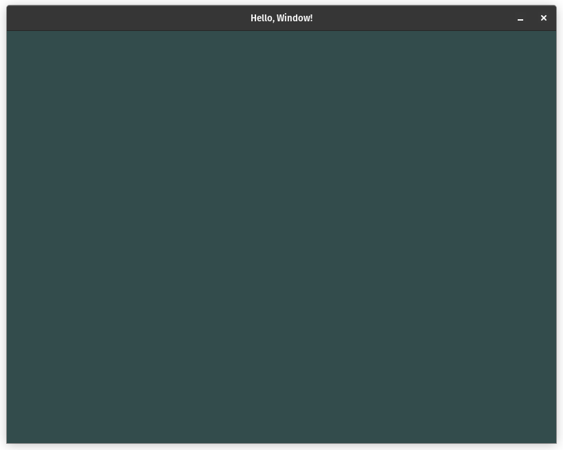
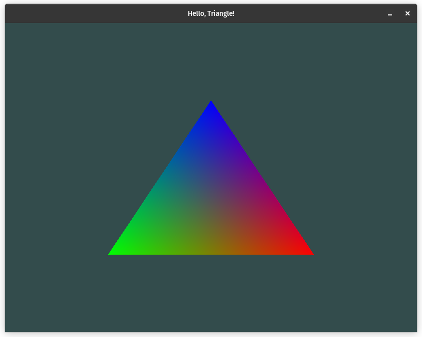
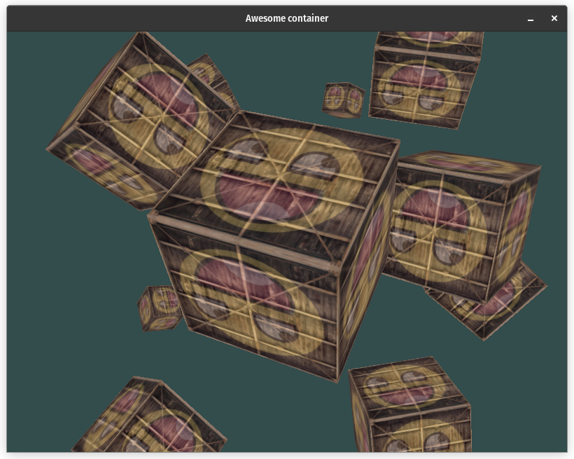
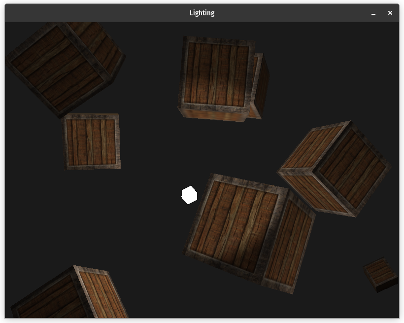
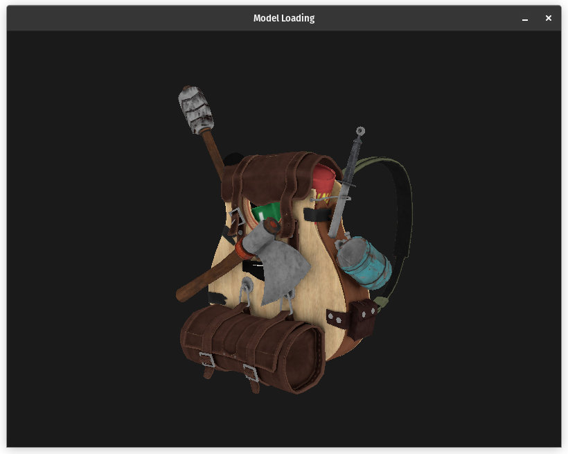

# OpenGL Playground

## Description

A simple setup for experimenting with OpenGL using GLFW, glad, stb_image, GLM and assimp.

Screenshots:

<p align="center">
  <!--  -->
  
  
  
  
</p>

## Table of Contents

- [Dependencies](#dependencies)
- [Installation](#installation)
- [Usage](#usage)
- [Credits](#credits)
- [License](#license)

## Dependencies

- OpenGL 3.3
- CMake 3.22.1

## Installation

Follow the steps below to setup the project on your machine:

1. Clone the repository

```shell
git clone https://github.com/rviu/OpenGL-Playground
```

2. Initialise and update the submodules

```shell
git submodule update --init --recursive
```

3. Configure and build

```shell
cd OpenGL-Playground
./configure_and_build.sh
```

Alternatively, you could run the cmake build commands manually

```shell
cmake -S . -B build
cmake --build build
```

## Usage

All the executables will be generated in the `bin` folder. To run an executable named `lighting`, run the following command:

```shell
./bin/lighting
```

## Credits

[Learn OpenGL](https://learnopengl.com/)

## License

MIT License
